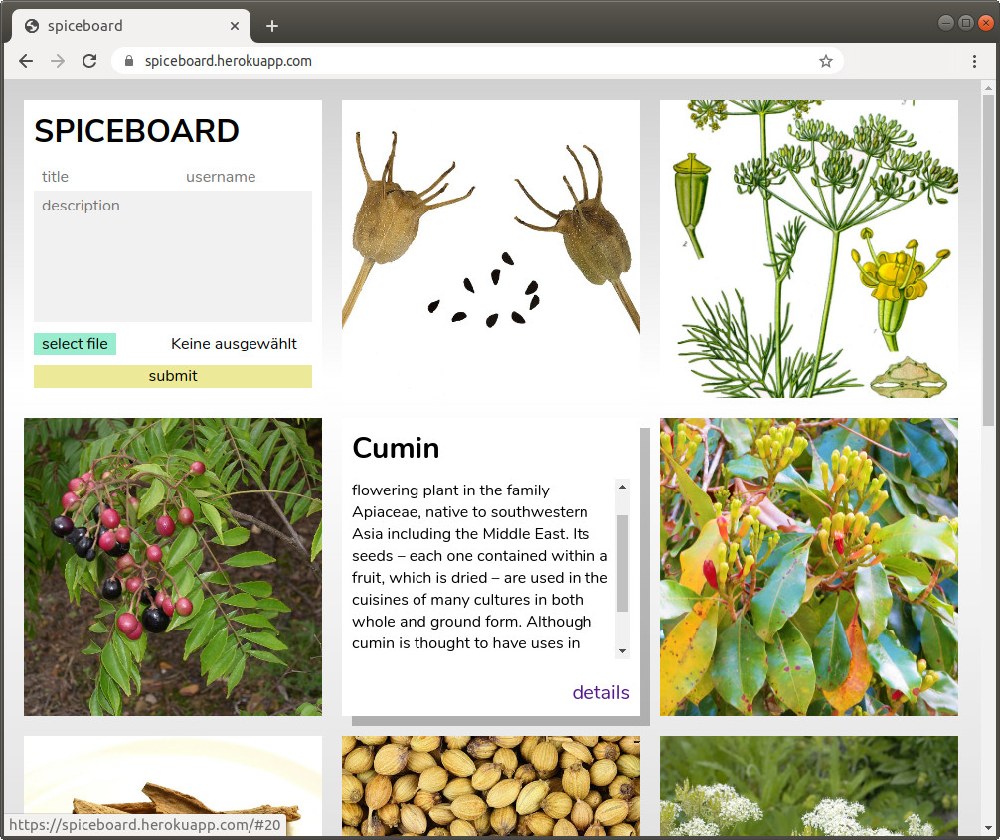

# spiceboard

A common spice collection. Anyone can publish spices with picture, title and description. Whoever is interested can leave comments.

# Demo

[https://spiceboard.herokuapp.com/](https://spiceboard.herokuapp.com/)

# Cause

Second full stack project I developed during webdev bootcamp at Spiced Academy.

# Completed Features

-   Made with Vue.js
-   Image upload to AWS S3
-   Handles pagination
-   Comments may be submitted

# In Development

-   full mobile compatible Version

# Technologies used

-   Frontend: HTML, CSS, JavaScript, Vue.js
-   Backend: Node.js, Express, PostgreSQL
